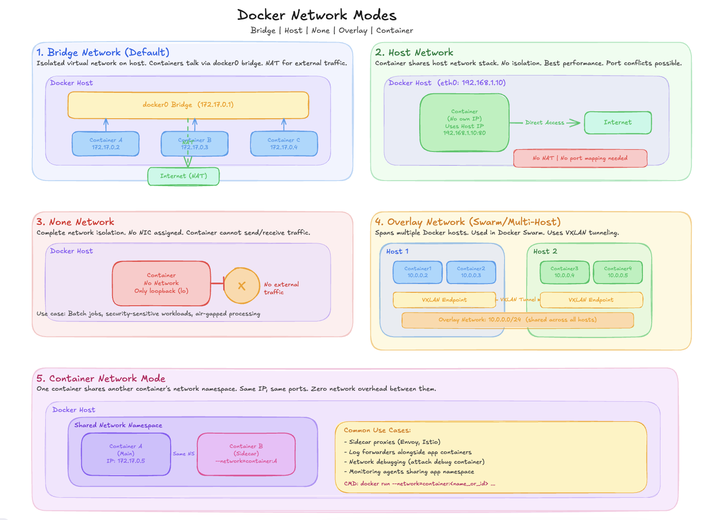

# 🐳 Docker Networking
### A Complete Reference Guide — Bridge | Host | None | Overlay | Container

> Includes architecture overview, commands, use cases, comparisons & best practices.

---

## 📋 Table of Contents

- [1. Introduction](#1-introduction)
- [2. Architecture Overview](#2-architecture-overview)
- [3. Bridge Network](#3-bridge-network)
- [4. Host Network](#4-host-network)
- [5. None Network](#5-none-network)
- [6. Overlay Network](#6-overlay-network)
- [7. Container Network](#7-container-network)
- [8. Full Comparison Table](#8-full-comparison-table)
- [9. Quick Command Reference](#9-quick-command-reference)
- [10. Best Practices](#10-best-practices)
- [11. Troubleshooting](#11-troubleshooting)

---

## 1. Introduction

Docker networking enables containers to communicate with each other, with the host machine, and with external networks. Every container is connected to at least one network (unless explicitly disabled).

Docker ships with **five built-in network drivers:**

| Driver | Description |
|---|---|
| `bridge` | Default isolated virtual network on a single host |
| `host` | Container shares the host machine's network stack directly |
| `none` | Completely air-gapped; no network interface except loopback |
| `overlay` | Multi-host networking spanning a Docker Swarm cluster |
| `container` | Two containers share the same network namespace |

> 💡 Third-party plugins (Weave, Calico, Flannel) are also available for advanced use cases such as Kubernetes CNI.

---

## 2. Architecture Overview



---

## 3. Bridge Network

The **default network driver**. When you run a container without `--network`, it connects to the `docker0` bridge automatically.

### How It Works

- Docker creates a virtual Ethernet bridge called `docker0` on the host (typically `172.17.0.1`)
- Each container receives its own IP from the bridge subnet (e.g., `172.17.0.2`, `172.17.0.3`)
- Containers on the same bridge communicate directly using container IPs
- External traffic is **NAT'd** through the host's network interface
- Port mapping (`-p 8080:80`) is **required** to expose services externally

### Commands

```bash
# List all networks
docker network ls

# Create a custom bridge network
docker network create --driver bridge my-bridge-net

# Run a container on the default bridge
docker run -d --name webserver -p 8080:80 nginx:latest

# Run on a custom bridge network
docker run -d --name api --network my-bridge-net -p 3000:3000 node:18

# Connect existing container to a network
docker network connect my-bridge-net webserver

# Inspect the bridge network
docker network inspect bridge
```

### Use Cases

- Default containerised workloads that need internet access
- Development environments running multiple microservices on one host
- Services that need controlled inter-container communication
- Applications requiring port-based exposure to the host

### Default Bridge vs User-Defined Bridge

| Feature | Default Bridge | User-Defined Bridge |
|---|---|---|
| DNS resolution | By IP only | By container name ✅ |
| Isolation | All containers shared | Scoped to network ✅ |
| Legacy `--link` | Supported | Not needed |
| Network config | Fixed defaults | Configurable subnet/gateway |

> ✅ **Recommendation:** Always use user-defined bridge networks. They provide automatic DNS resolution between containers using container names.

---

## 4. Host Network

The container **bypasses Docker's virtual networking** and directly uses the host machine's network stack. No isolation between container and host.

### How It Works

- Container shares the host's `eth0`, `lo`, and all other interfaces
- Uses the **host's IP address** — no separate container IP exists
- Ports used by the container are ports on the host directly
- **No port mapping** (`-p`) needed or supported
- Zero NAT overhead → **maximum network performance**

### Commands

```bash
# Run container in host network mode
docker run -d --network host nginx:latest

# Verify — container uses host IP
docker inspect <container_id> | grep -i network

# Check open ports on host (container ports are visible here)
ss -tlnp | grep :80
```

### Use Cases

- High-performance applications where NAT latency is unacceptable
- Network monitoring tools needing access to raw host interfaces
- Applications that bind to many dynamic ports
- When the container needs to interact with host-level networking directly

> ⚠️ **WARNING:** Host network mode removes all network isolation. A compromised container can directly interact with all host network interfaces. Use only when performance requirements justify the security trade-off.
>
> ⚠️ **macOS/Windows:** Host network mode is **not supported** on Docker Desktop (macOS/Windows). It only works natively on Linux hosts.

---

## 5. None Network

**Completely disables networking** for a container. No network interface is assigned except the loopback (`lo` at `127.0.0.1`). The container is fully air-gapped.

### How It Works

- Docker creates the container with **only** the loopback (`lo`) interface
- No `eth0`, no IP address, no gateway, no DNS resolver
- Cannot reach any other container, the host, or the internet
- Processes can only communicate with themselves via `127.0.0.1`

### Commands

```bash
# Run container with no network
docker run --network none alpine sh

# Verify inside the container
ip addr show          # only shows lo (127.0.0.1)
ping 8.8.8.8          # Network is unreachable
curl https://google.com  # Fails immediately
```

### Use Cases

- Security-sensitive data processing that must not leak over the network
- Batch computation jobs (ML training, file transformation) with no network dependency
- Compliance workloads requiring verifiable network isolation
- Testing container behaviour in a fully isolated environment

> 💡 Even with `--network none`, the container's filesystem and process namespaces still function normally. **Only networking is disabled.**

---

## 6. Overlay Network

Enables containers running on **different Docker hosts** to communicate as if they were on the same local network. The backbone of Docker Swarm multi-host networking.

### How It Works

```
Host 1 (Swarm Node)              Host 2 (Swarm Node)
┌──────────────────┐             ┌──────────────────┐
│  Container 1     │             │  Container 3     │
│  10.0.0.2        │             │  10.0.0.4        │
│  Container 2     │             │  Container 4     │
│  10.0.0.3        │             │  10.0.0.5        │
│  [VXLAN Tunnel]  │◄───────────►│  [VXLAN Tunnel]  │
└──────────────────┘  Encrypted  └──────────────────┘
        │                                 │
        └──────── Overlay Subnet ─────────┘
                  10.0.0.0/24
```

- Container traffic is encapsulated inside **VXLAN packets** tunnelled between hosts
- Docker Swarm's built-in key-value store synchronises network state across nodes
- Each container gets a virtual IP in the overlay subnet (e.g., `10.0.0.0/24`)
- Traffic can be **encrypted** with `--opt encrypted`

### Commands

```bash
# Initialise Docker Swarm (required for overlay)
docker swarm init --advertise-addr <manager-ip>

# Create an overlay network
docker network create --driver overlay --attachable my-overlay

# Create an encrypted overlay network
docker network create --driver overlay --opt encrypted secure-net

# Deploy a Swarm service on overlay
docker service create --name webapp --network my-overlay -p 80:80 nginx

# Inspect overlay network
docker network inspect my-overlay

# Join another node to the Swarm
docker swarm join --token <worker-token> <manager-ip>:2377
```

### Required Firewall Ports

| Port | Protocol | Purpose |
|---|---|---|
| `2377` | TCP | Swarm cluster management |
| `7946` | TCP + UDP | Node-to-node discovery |
| `4789` | UDP | VXLAN data plane (overlay traffic) |

### Use Cases

- Microservices distributed across multiple physical or virtual hosts
- Docker Swarm service deployments requiring inter-service communication
- Applications needing automatic service discovery
- Encrypted east-west traffic between services

---

## 7. Container Network

Causes a new container to **share the complete network namespace** of an existing running container. Both containers have the same IP, same interfaces, and same port space.

### How It Works

```
┌─────────────────────────────────────────┐
│  Shared Network Namespace               │
│                                         │
│  ┌──────────────┐    ┌───────────────┐  │
│  │ Primary      │    │ Sidecar       │  │
│  │ Container    │◄──►│ Container     │  │
│  │ (app server) │    │ (log agent)   │  │
│  │ IP: 172.x.x  │    │ shares IP     │  │
│  │ has eth0     │    │ no own NIC    │  │
│  └──────────────┘    └───────────────┘  │
│           communicate via localhost      │
└─────────────────────────────────────────┘
```

- Primary container must already be running before the sidecar starts
- Both share one `eth0`, one IP address, one port space
- The sidecar has **no independent network stack**
- They communicate via `localhost` — no external network hops
- If the primary container stops, the sidecar **loses its network**

### Commands

```bash
# Start primary container first
docker run -d --name app-server -p 8080:80 nginx:latest

# Start sidecar sharing app-server's network namespace
docker run -d --name log-agent \
  --network container:app-server \
  fluentd:latest

# Both containers share the same IP
docker inspect app-server | grep IPAddress
docker inspect log-agent  | grep IPAddress   # same IP!

# Sidecar can reach primary via localhost
docker exec log-agent curl http://localhost:80
```

### Use Cases

- Sidecar logging containers (Fluentd, Filebeat, Logstash) co-located with an app
- Prometheus exporters or monitoring agents sharing the app's network namespace
- Service mesh sidecar proxies (Envoy, Linkerd) in non-Kubernetes environments
- Debug containers that need to inspect another container's network traffic

> 💡 This is the foundation of the **Kubernetes sidecar pattern**, where init containers and sidecars share a pod's network namespace.

---

## 8. Full Comparison Table

| Feature | Bridge | Host | None | Overlay | Container |
|---|---|---|---|---|---|
| **Driver name** | `bridge` | `host` | `none` | `overlay` | `container` |
| **Network scope** | Single host | Single host | Single host | Multi-host | Single host |
| **Isolation** | Partial (NAT) | None | Full | Partial | Shared |
| **Port mapping** | Required | Not needed | N/A | Service ports | Inherited |
| **IP assignment** | `172.17.x.x` | Host IP | None | `10.0.x.x` | Shared IP |
| **Performance** | Good | Best | N/A | Good | Best (shared) |
| **Multi-host** | ❌ | ❌ | ❌ | ✅ | ❌ |
| **Swarm required** | ❌ | ❌ | ❌ | ✅ | ❌ |
| **DNS by name** | User-defined only | N/A | N/A | ✅ | Inherited |
| **Best for** | Default workloads | High-perf apps | Security/batch | Microservices | Sidecar pattern |

---

## 9. Quick Command Reference

### Network Lifecycle

| Command | Description |
|---|---|
| `docker network ls` | List all networks on the host |
| `docker network create <n>` | Create a new network (default driver: bridge) |
| `docker network inspect <n>` | Show detailed config and connected containers |
| `docker network rm <n>` | Remove a network (no connected containers) |
| `docker network prune` | Remove all unused networks |
| `docker network connect <net> <c>` | Connect a running container to a network |
| `docker network disconnect <net> <c>` | Disconnect a container from a network |

### Running Containers with Specific Networks

| Command | Description |
|---|---|
| `docker run --network bridge` | Use default bridge (explicit) |
| `docker run --network host` | Use host network mode |
| `docker run --network none` | Disable all networking |
| `docker run --network my-overlay` | Use named overlay network |
| `docker run --network container:<n>` | Share another container's namespace |
| `docker run -p 8080:80` | Map host port 8080 → container port 80 |
| `docker run --network my-net --dns 8.8.8.8` | Set custom DNS for container |
| `docker run --ip 172.20.0.5` | Assign static IP to container |
| `docker network create --internal` | Create network with no external internet access |

---

## 10. Best Practices

- ✅ **Use user-defined bridge networks** — not the default bridge. They provide container name DNS resolution and better isolation.
- ✅ **Encrypt overlay networks** with `--opt encrypted` for sensitive inter-service traffic in Swarm.
- ✅ **Principle of least privilege** — connect each container only to the networks it actually needs.
- ✅ **Use `--internal` flag** on bridge networks that should not have external internet access.
- ✅ **Use `none` for security-critical workloads** that process sensitive data and need verifiable isolation.
- ✅ **Use `container` network for sidecar patterns** over bind-mounted Unix sockets when processes need loopback communication.
- ✅ **Run `docker network prune` regularly** to remove stale, unused networks and free up resources.
- ✅ **Document your network topology** — export `docker network inspect` to JSON for audits and debugging.
- ❌ **Avoid `host` networking in production** unless you have a specific, justified performance requirement and understand the security implications.
- ❌ **Never expose container ports unnecessarily** — only map ports that external clients actually need.

---

## 11. Troubleshooting

### Common Diagnostic Commands

```bash
# List all networks and their drivers
docker network ls

# Check which containers are on a network
docker network inspect <network-name>

# Check container network settings
docker inspect <container> --format '{{json .NetworkSettings}}'

# Test connectivity between containers
docker exec <container-a> ping <container-b>
docker exec <container-a> curl http://<container-b>:80

# Check DNS resolution inside container
docker exec <container> nslookup <service-name>

# View iptables rules Docker has created
sudo iptables -L -n -v | grep DOCKER

# Check open ports on the host
ss -tlnp
```

### Common Issues & Fixes

| Problem | Fix |
|---|---|
| Containers can't reach each other | Ensure both are on the same **user-defined** network |
| Port already in use | Check with `ss -tlnp \| grep <port>` |
| DNS not resolving container name | Switch to user-defined bridge (not default bridge) |
| Overlay network unreachable | Check Swarm ports `2377`, `7946`, `4789` are open |
| Host network not working on macOS | Host mode is **not supported** on Docker Desktop (macOS/Windows) |
| Container IP keeps changing | Assign static IP: `docker run --ip 172.20.0.5` |
| Can't connect to service by name | Ensure containers are on the same named overlay/bridge network |
| Overlay network containers isolated | Check `--attachable` flag was used on the overlay network |

---

## 📚 References

- 🔗 [Docker Networking Overview](https://docs.docker.com/network/)
- 🔗 [Docker Network Drivers](https://docs.docker.com/network/drivers/)
- 🔗 [Docker Swarm Overlay Networks](https://docs.docker.com/network/overlay/)
- 🔗 [Docker Compose Networking](https://docs.docker.com/compose/networking/)

---

> 📄 *Part of the Docker Learning Series — see also: [Docker Volume Guide](./Docker_Volume.md)*
