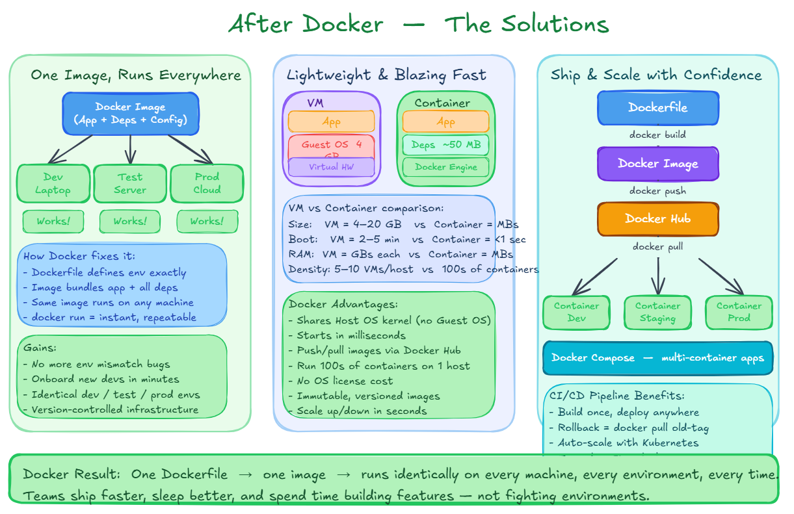
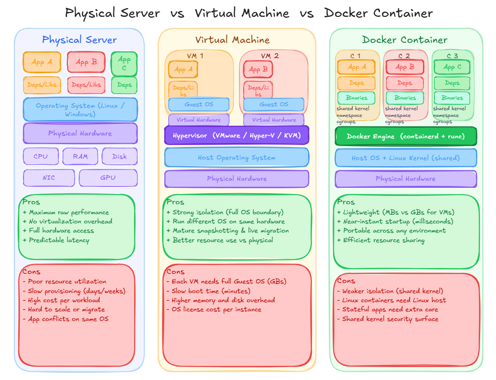

# 🐳 What is Docker?

> A beginner-friendly guide to Docker — containerization, containers vs VMs, and alternatives.

---

## 📋 Table of Contents

- [What is Docker?](#what-is-docker)
- [What Does a Container Bundle?](#-what-does-a-container-bundle)
- [Why Docker?](#-why-docker)
  - [Before Docker](#️-before-docker)
  - [With Docker](#-with-docker)
- [Docker vs Virtual Machines vs Containers](#-docker-vs-virtual-machines-vs-containers)
- [Docker Alternatives](#-best-docker-alternatives)
- [Further Reading](#-further-reading)
- [Contributing](#-contributing)

---

## What is Docker?

**Docker** is an **open-source containerization platform** that allows you to build, package, and run applications in **lightweight, portable containers**.

Containers package everything your application needs to run — so it works the same everywhere, from your laptop to the cloud.

---

## 📦 What Does a Container Bundle?

A Docker container includes all of the following:

| Component | Description |
|-----------|-------------|
| Application code | Your app's source files |
| Runtime | JVM, Python, Node.js, etc. |
| System libraries | OS-level dependencies |
| Environment variables | Config values at runtime |
| Configuration | App settings and configs |

---

## ❓ Why Docker?

### ⚠️ Before Docker

- Applications depended heavily on the **OS and environment**
- **"Works on my machine"** problems were extremely common
- **Virtual Machines (VMs)** were the alternative — but heavy and slow

### ✅ With Docker

- Containers are **lightweight**
- Start in **seconds**
- Share the **host OS kernel**
- Easy to **scale, ship, and deploy**

---

## 🔄 Docker vs Virtual Machines vs Containers

### Virtual Machines (VMs)

- Each VM includes a **full OS + Application**
- Managed by a **Hypervisor**
- **Heavy** — takes minutes to start
- **High** resource overhead

### Docker Containers

- Containers share the **Host OS Kernel**
- Managed by the **Docker Engine**
- **Lightweight** — start in seconds
- **Low** resource overhead

> 💡 Docker containers are isolated from each other and from the host, but share the OS kernel — making them far more efficient than full VMs.

---

## 🔀 Best Docker Alternatives

While Docker is the most popular containerization tool, several alternatives are worth knowing:

### [Podman](https://podman.io/)
- **Daemonless** container engine — no background service required
- Drop-in replacement for Docker CLI commands
- Rootless containers for improved security

### [Kubernetes](https://kubernetes.io/)
- Container **orchestration platform** for managing clusters
- Automates deployment, scaling, and operations of containers
- Industry standard for production-scale workloads

### [Red Hat OpenShift](https://www.redhat.com/en/technologies/cloud-computing/openshift)
- Enterprise Kubernetes platform built by Red Hat
- Adds developer tools, CI/CD pipelines, and security policies
- Used widely in enterprise environments

### [Hyper-V Containers](https://learn.microsoft.com/en-us/virtualization/hyper-v-on-windows/about/)
- Windows-native container technology from Microsoft
- Provides stronger isolation using a lightweight VM per container
- Integrated with Windows Server and Azure

> 📝 Docker remains the go-to choice for local development and simple deployments. For production clusters, Kubernetes (often with Docker or containerd underneath) is the standard.

---

## 📚 Further Reading

- [Official Docker Documentation](https://docs.docker.com/)
- [Docker Getting Started Guide](https://docs.docker.com/get-started/)
- [Play with Docker (Interactive)](https://labs.play-with-docker.com/)
- [Docker Hub](https://hub.docker.com/)

---

## 🤝 Contributing

Contributions are welcome! Please open an issue or submit a pull request.

1. Fork this repository
2. Create your feature branch: `git checkout -b feature/my-addition`
3. Commit your changes: `git commit -m 'Add some content'`
4. Push to the branch: `git push origin feature/my-addition`
5. Open a Pull Request

---

## 📄 License

This project is licensed under the MIT License — see the [LICENSE](LICENSE) file for details.
