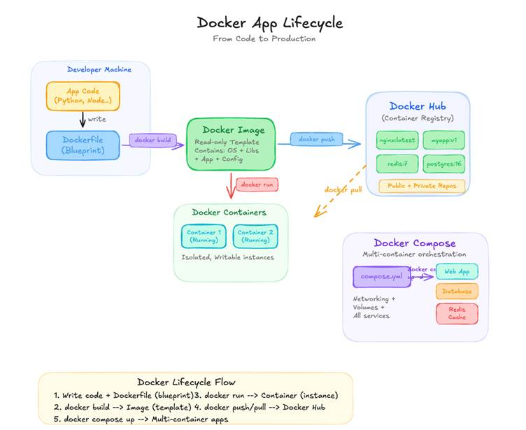
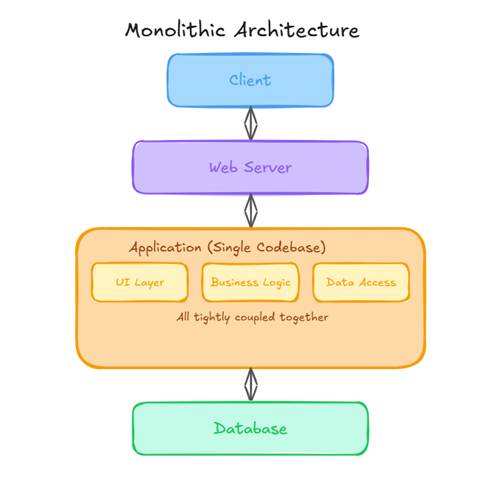
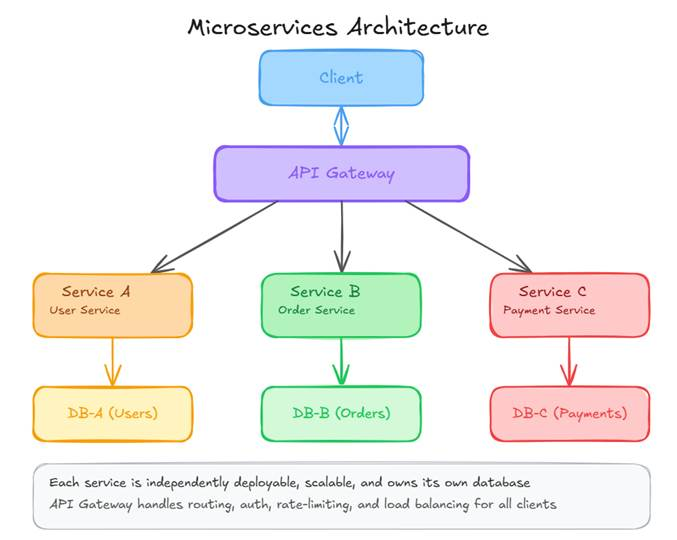

# 📦 What is a Container?

> A beginner-to-intermediate guide covering containers, the Docker app lifecycle, and Monolithic vs Microservices architecture.

---

## 📋 Table of Contents

- [What is a Container?](#-what-is-a-container)
- [Docker App Lifecycle](#-docker-app-lifecycle)
- [Monolithic Architecture](#-monolithic-architecture)
  - [Characteristics](#characteristics)
  - [Advantages](#-advantages)
  - [Disadvantages](#-disadvantages)
- [Microservices Architecture](#-microservices-architecture)
  - [Characteristics](#️-characteristics)
  - [Infrastructure Perspective](#️-infrastructure-perspective)
  - [Advantages](#-advantages-1)
  - [Disadvantages](#-disadvantages-1)
- [Monolithic vs Microservices — Comparison](#-monolithic-vs-microservices--comparison)
- [Examples](#-examples)
- [Further Reading](#-further-reading)

---

## 📦 What is a Container?

In computing, a **container** is a lightweight, standalone package of software that includes everything needed to run an application — code, runtime, system tools, libraries, and settings.

It **abstracts the application from the underlying infrastructure**, ensuring it runs consistently across different environments:

- 💻 A developer's laptop
- 🧪 A test/staging server
- ☁️ The cloud

---

## 🐳 Docker App Lifecycle

The Docker app lifecycle describes how an application moves from source code to a running container:

| Stage | Description |
|-------|-------------|
| **Write** | Developer writes application code |
| **Build** | `docker build` creates an image from a Dockerfile |
| **Ship** | Image is pushed to a registry (Docker Hub, ECR, etc.) |
| **Run** | `docker run` starts a container from the image |

---

## 🧱 Monolithic Architecture

### Definition

A **single unified application** where all components — UI, business logic, and database access — are tightly coupled and deployed as **one unit**.

### Characteristics

- Single codebase (all modules together)
- Single deployment unit (WAR / JAR / EXE)
- Shared memory & process space
- Typically runs on one server or VM

### ✅ Advantages

- Simple to develop (especially at the initial stage)
- Easy debugging (single process)
- Faster local testing
- No network latency between components

### ❌ Disadvantages

- Hard to scale (the entire app must scale together)
- Tight coupling → changes are risky
- Slower deployments
- Technology lock-in
- Single point of failure

---

## 🧩 Microservices Architecture

### Definition

An architecture where the application is split into **small, independent services**, each responsible for a specific function.

### ⚙️ Characteristics

- Each service = independent codebase
- Own database per service
- Services communicate via APIs (REST / gRPC)
- Independently deployable

### 🖥️ Infrastructure Perspective

| Concern | Approach |
|---------|----------|
| **Runtime** | Containers (Docker) |
| **Orchestration** | Kubernetes / ECS |
| **Scaling** | Horizontal scaling per service |
| **Deployment** | Independent CI/CD pipelines |

### ✅ Advantages

- Highly scalable (scale only what's needed)
- Loose coupling between services
- Faster, independent deployments
- Technology flexibility (polyglot stacks)
- Fault isolation — one service fails, others stay up

### ❌ Disadvantages

- Complex architecture to manage
- Network latency between service-to-service calls
- Harder debugging in distributed systems
- Requires DevOps maturity
- Data consistency challenges across services

---

## 📊 Monolithic vs Microservices — Comparison

| Aspect | Monolithic | Microservices |
|--------|-----------|---------------|
| Codebase | Single | Multiple independent |
| Deployment | All at once | Per service |
| Scaling | Entire app | Per service |
| Failure Impact | Full app down | Isolated service |
| Tech Stack | Single | Polyglot possible |
| Complexity | Low (initially) | High |
| Best For | Small teams / MVPs | Large-scale systems |

---

## 💡 Examples

Explore the [`examples/`](./examples/) directory for hands-on starter files:

| File | Description |
|------|-------------|
| [`Dockerfile`](examples/Dockerfile) | Basic multi-stage Dockerfile |
| [`docker-compose.yml`](examples/docker-compose.yml) | Microservices with Docker Compose |
| [`k8s-deployment.yaml`](examples/k8s-deployment.yaml) | Kubernetes deployment manifest |

---

## 📚 Further Reading

- [Official Docker Documentation](https://docs.docker.com/)
- [Microservices.io — Pattern Reference](https://microservices.io/)
- [12 Factor App](https://12factor.net/)
- [Kubernetes Docs](https://kubernetes.io/docs/home/)
- [Martin Fowler on Microservices](https://martinfowler.com/articles/microservices.html)

---

